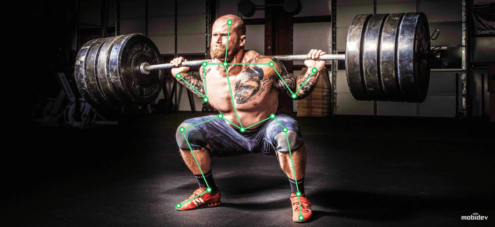
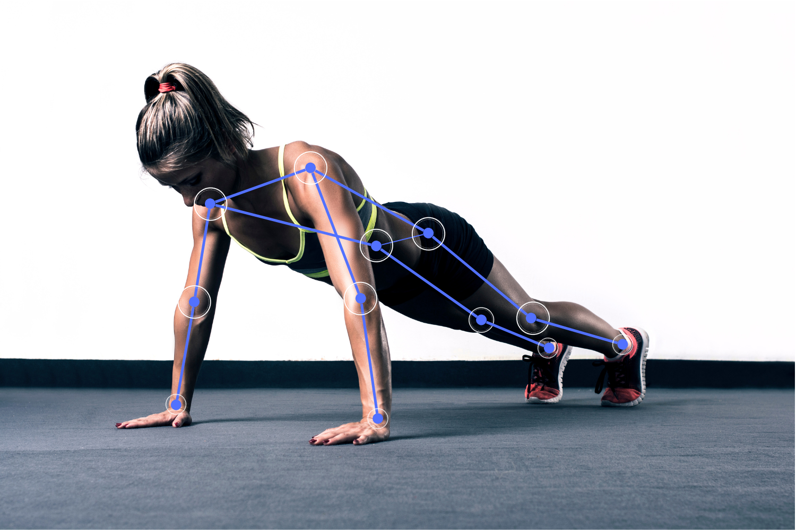

### Installation

1. Clone the repository:

   ```bash
   git clone https://github.com/Sovik-Ghosh/GymJam-AI-assistant-using-mediapipe.git
   ```

2. Navigate to the project directory:

   ```bash
   cd GymJam-AI-assistant-using-mediapipe/backend
   ```

3. Create a virtual environment:
   ```bash
   python3 -m venv my_env
   ```

4. Activate the virtual environment:
   ```bash
   # macOS/Linux
   source my_env/bin/activate
   # Windows PowerShell
   my_env\\Scripts\\Activate.ps1
   ```

5. Install dependencies:
   ```bash
   pip install -r requirements.txt
   ```
## Framework

### Mediapipe:


MediaPipe is an open-source framework developed by Google that provides a comprehensive solution for building machine learning (ML) pipelines to process multimedia data, including video, audio, and image streams. It is designed to facilitate the development of real-time perception and processing pipelines, particularly for tasks related to computer vision and media processing.

## Running the App

1. Start the Flask server from the `backend` directory:
   ```bash
   python app.py
   ```
2. Open your browser to:
   ```
   http://localhost:5000/
   ```
3. Use the buttons to start a stream (Left Curl, Right Curl, Push-up, Squat). Click Stop to end the stream.

Direct stream URLs (optional):
- Left Bicep Curl: `http://localhost:5000/video_feed_left`
- Right Bicep Curl: `http://localhost:5000/video_feed_right`
- Pushup: `http://localhost:5000/video_feed_pushup`
- Squat: `http://localhost:5000/video_feed_squat`

Note: Camera access requires running locally. Most cloud hosts do not expose a physical webcam device.

## Exercise Overview

<div style="display: flex; justify-content: center;">
  
  
</div>

## Customizing and Extending

Feel free to customize the project to implement your strategies and behaviors for extending exercise variations.

You can modify the existing controllers or create new ones.
1. [PoseModule.py](backend/PoseModule.py) is the base file containing different functions for calculating angle, tracking position, capturing video feed.
2. [app.py](backend/app.py) uses Flask to render captured webcam frames to the webpage
3. [pose_left.py](backend/pose_left.py) calculates and corrects left arm bicep curl
4. [pose_right.py](backend/pose_right.py) calculates and corrects right arm bicep curl
5. [pose_pushup.py](backend/pose_pushup.py) calculates and corrects pushup using coordinates from the left side
6. [pose_squat.py](backend/pose_squat.py) calculates and corrects squat using coordinates from the left side

Additionally, you can explore advanced features provided by [Mediapipe](https://developers.google.com/mediapipe).

## Deployment

- A `procfile.txt` is included with a `gunicorn` command (`web: gunicorn app:app`). This is only suitable when a physical camera is available to the host. For local production-like runs, install requirements and run:
  ```bash
  gunicorn -w 1 -b 0.0.0.0:5000 app:app
  ```

## License

This project is licensed under the [Apache License 2.0](LICENSE).
